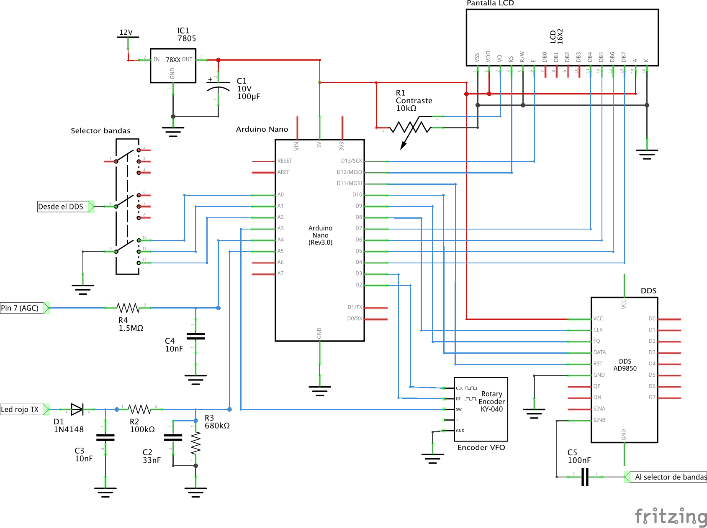
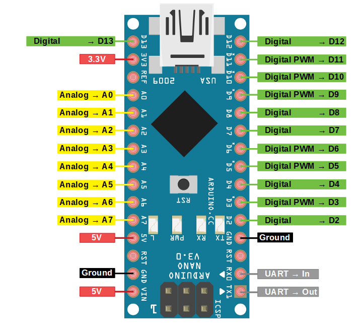

- [Reformas](#reformas)
  - [Diagrama esquemático completo](#diagrama-esquem%c3%a1tico-completo)
  - [Pinout del Arduino Nano](#pinout-del-arduino-nano)
  - [Fuente de alimentación](#fuente-de-alimentaci%c3%b3n)
  - [Selector de canales](#selector-de-canales)
  - [Ajuste de frecuencia por encoder rotativo](#ajuste-de-frecuencia-por-encoder-rotativo)
  - [Pantalla LCD](#pantalla-lcd)
  - [DDS AD9850](#dds-ad9850)
  - [Radiofrecuencia](#radiofrecuencia)
- [Operación](#operaci%c3%b3n)
- [Instalación del código en el Arduino Nano](#instalaci%c3%b3n-del-c%c3%b3digo-en-el-arduino-nano)
  - [Subir el código](#subir-el-c%c3%b3digo)
  - [Configuraciones posibles](#configuraciones-posibles)
# Reformas
Se muestran una serie de reformas y ajustes necesarios para instalar el DDS en
un equipo tipo Cahuane FR-300

## Diagrama esquemático completo
El diagrama eléctrico completo se muestra a continuación. Mas adelante se
detalla cada sección por separado para mejor interpretación

## Pinout del Arduino Nano
Es importante familiarizarse con la notación de los pines del Arduino Nano. De
esta manera será mas sencillo seguir la guía de ensamble

## Fuente de alimentación
Se utiliza un regulador de tensión de la linea 78xx, en este caso de 5 volts
(7805) con un capacitor electrolítico de 10v y 100uF a la salida para filtrar
cualquier tipo de ruido que pueda traer problemas a la electrónica sensible.

## Selector de canales
El DDS utiliza la llave selectora de canales del equipo para cambiar entre las
diferentes bandas. La llave rotativa tiene una isla completa vacía que puede
utilizarse para este fin

Cada pin de la llave selectora es conectada al Arduino Nano. Si no sabe que
pines conectar, por favor refiérase al [pinout del Arduino
Nano](#pinout-del-arduino-nano) descripto anteriormente

## Ajuste de frecuencia por encoder rotativo
El VFO funciona a través de un encoder rotativo. Es un dispositivo que maneja
una señal digital del tipo tren de pulsos. El Arduino interpreta esa información
y el código permite ajustar la frecuencia. También posee un botón que tiene
diferentes usos dependiendo de la forma en que se toque. Para mas información al
respecto, leer la sección [operación](#operaci%c3%b3n).

## Pantalla LCD
Se utiliza una pantalla LCD de 16x2 caracteres basada en el controlador HD44780.
El contraste se regula a través de un potenciometro que varía la tensión en el
pin `VEE`. Se puede utilizar un potenciometro de 10kohms para ajustar el
contraste hasta el nivel deseado, luego medir la resistencia del potenciometro
en esa posición y colocar una resistencia fija. La iluminación del display se
hace a través de los pines `LED+` y `LED-`. Se puede colocar una resistencia de
pequeño valor si el nivel de luz es demasiado fuerte. Exceptuando la
alimentación por los pines `VSS` y `VCC`, el resto de los pines se conectan
directamente al Arduino.

## DDS AD9850
Informaciíon de como conectar el AD9850 al Arduino

## Radiofrecuencia
Información de como conectar el DDS al equipo en su parte de radiofrecuencia

# Operación

La operación se realiza con dos controles: el selector de banda original (se
utiliza una isla vacía) y un encoder rotativo con botón. El encoder cumple la
función de VFO, sintonizando la frecuencia, y el botón incluído en él tiene
diferentes funciones dependiendo de los toques. Un toque corto cambia el step o
incremento entre 10 Hz, 100 Hz, 1 KHz, 10 KHz, 100 KHz y 1 MHz de manera
ascendente. Dos toques cortos hacen lo mismo de manera descendente. Un toque
largo (+2 segundos) intercambia entre los modos LSB y USB.

# Instalación del código en el Arduino Nano
Una vez clonado este repositorio, abrir el archivo `dds.ino` en Arduino. Todas
las librerías necesarias están incluidas en el repositorio, de esta manera no
hay que tomarse el trabajo extra de instalar versiones especificas de cada
librería. El código se encuentra comentado para que sea mas sencilla su revisión
y modificación

## Subir el código
Con el Arduino Nano conectado a un puerto USB, presionar el botón `Upload` en el
software Arduino

## Configuraciones posibles
* **Modo debug:** El modo debug se utiliza en caso de que algo del funcionamiento
  del DDS no esté ocurriendo como es deseado. Para poder encontrar el problema
  es de utilidad activar los mensajes de depuración. Para esto, descomentar la
  [línea 21](https://github.com/reynico/arduino-dds/blob/master/dds.ino#L21)
* **Pinout:** Se puede variar el pinout de cada parte. Para ello es necesario
  modificar la configuración de los pines en el archivo correspondiente al
  módulo que se desea modificar. En caso de querer cambiar los pines del DDS,
  entonces se debe editar en el archivo [ad9850.h](https://github.com/reynico/arduino-dds/blob/master/ad9850.h)
